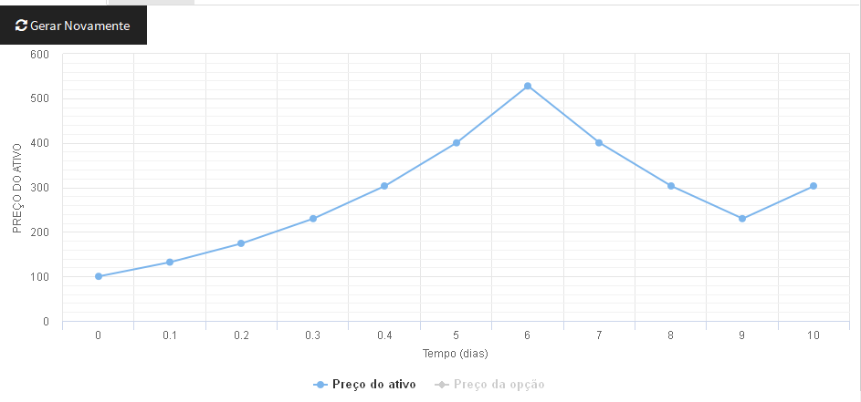
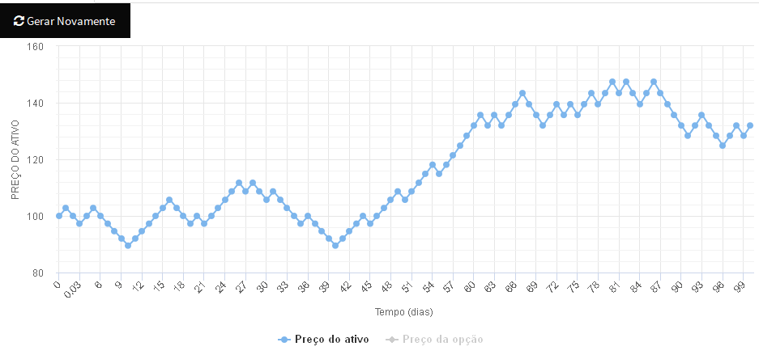

```{r setup, include=FALSE}
knitr::opts_chunk$set(echo = TRUE)
```

*Observação:* o aplicativo que desenvolvi para essa atividade pode ser testado
em

`http://lurodrigo.com/mmfin1/bopm/` 

**Atividade 2:** O valor de $u$ será $u_a^{\frac{T}{360N}}$. Basta ver que 
$u_d = u_a^{\frac{1}{360}}$. Tendo a taxa diária, o valor de $u$ deve ser tal
que $u^N = u_d^T$, e aí obtemos a fórmula acima. Utilizando o mesmo raciocínio,
encontramos $r = (1+r_a)^{\frac{T}{360N}} - 1$.

**Atividade 3:** Tanto faz, pois as transformação $u \mapsto u^{\frac{1}{360}}$ e
$r \mapsto (1 + r)^{\frac{1}{360}} - 1$ são crescentes, ou seja, preservam
as comparações.

Aqui abaixo estão exemplos de random walks com todos os parâmetros iguais, exceto
pelo $N$, que é 10 ou 100.




Naturalmente, além dos resultados diferentes dos lançamentos de moeda, a diferença
está na *resolução* do modelo: um modelo com N maior contempla uma quantidade
maior de valores possíveis para o valor final do ativo.

**Atividade 4:**

**Atividade 5:**

**Atividade 6:**
