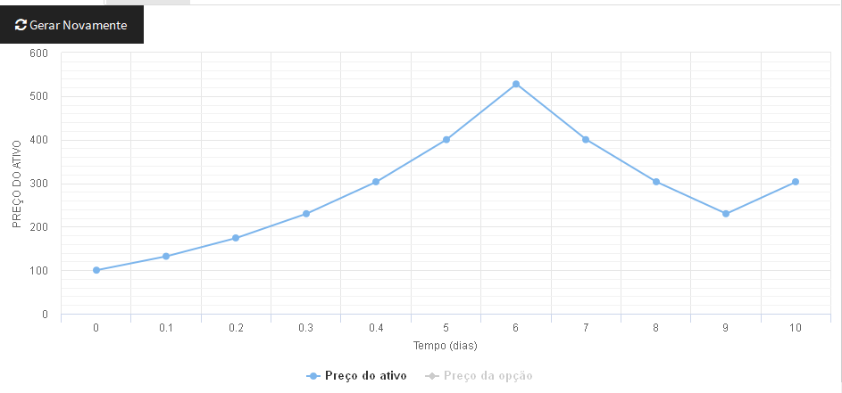
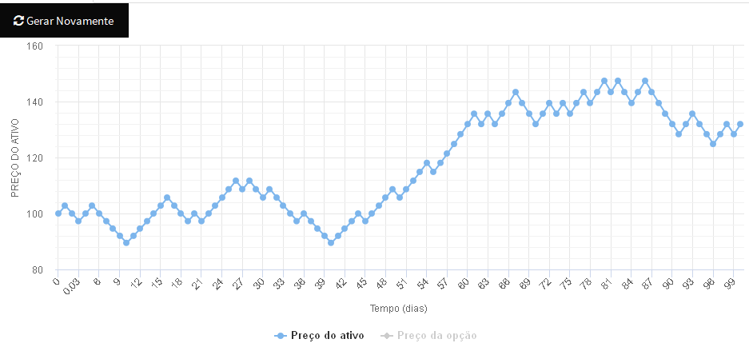
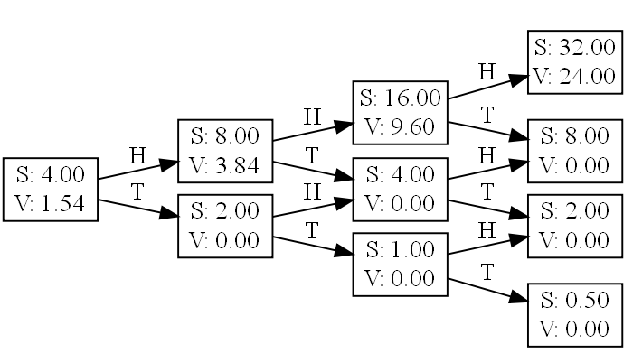
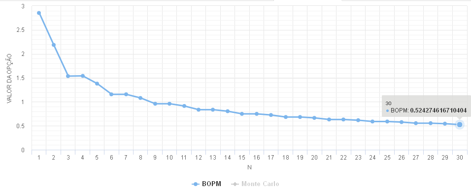
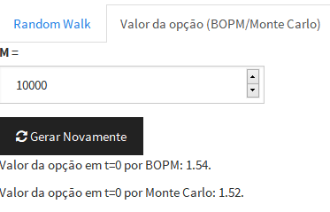
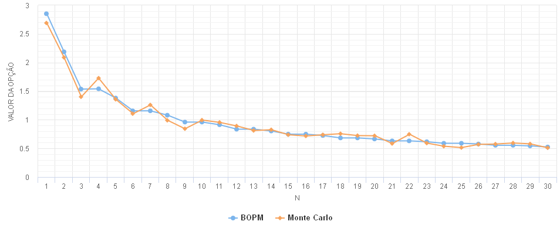

```{r setup, include=FALSE}
knitr::opts_chunk$set(echo = TRUE)
```

*Observação:* o aplicativo que desenvolvi para essa atividade pode ser testado
em [http://lurodrigo.com/mmfin1/bopm/](http://lurodrigo.com/mmfin1/bopm/)

**Atividade 2:** O valor de $u$ será $u_a^{\frac{T}{360N}}$. Basta ver que 
$u_d = u_a^{\frac{1}{360}}$. Tendo a taxa diária, o valor de $u$ deve ser tal
que $u^N = u_d^T$, e aí obtemos a fórmula acima. Utilizando o mesmo raciocínio,
encontramos $r = (1+r_a)^{\frac{T}{360N}} - 1$.

**Atividade 3:** Tanto faz, pois as transformação $u \mapsto u^{\frac{1}{360}}$ e
$r \mapsto (1 + r)^{\frac{1}{360}} - 1$ são crescentes, ou seja, preservam
as comparações.

As figuras 1 e 2 têm exemplos de random walks com todos os parâmetros iguais, exceto
pelo $N$, que é 10 ou 100.





Naturalmente, além dos resultados diferentes dos lançamentos de moeda, a diferença
está na *resolução* do modelo: um modelo com N maior contempla uma quantidade
maior de valores possíveis para o valor final do ativo.

**Atividade 4:** Fiz esse gráfico para o exemplo 1.2.2 do livro. A diferença
está somente no payoff, que é de uma call option e não de uma loopback option.
O diagrama gerado pode ser visto na figura 3.



O gráfico na figura 4 mantém os parâmetros fixos, exceto N, que varia. Parece haver
convergência para um valor não-nulo à medida que N aumenta.



**Atividade 5:**

Implementei uma função para estimar o valor da opção por Monte Carlo especificando
o número de tentativas (figura 5). Os valores costumam estar bem próximos dos
estimados pelo modelo binomial.



Para ver o comportamento em função de N, plotei as séries estimadas pelo modelo
binomial e por monte carlo lado a lado (figura 6). De fato o comportamento de ambas é
bastante parecido. Para fins do gráfico, utilizei M = 1000.



**Atividade 6:**

Para $r_a$, basta olhar a taxa básica de juros local, como a SELIC ou a LIBOR.
Como elas podem variar, pode-se usar uma média ao longo do tempo. Podemos
estimar $u_d$ como a média aritmética dos retornos diários $\frac{S_{n+1}}{S_n}$ 
e depois aplicar uma transformação para encontrar $u_a$.
