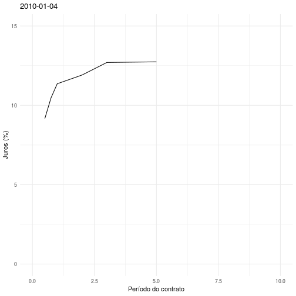

```{r setup, include=FALSE}
knitr::opts_chunk$set(echo = TRUE)
```

Carregando os pacotes...

```{r, message = FALSE, warning = FALSE}
library(tidyverse)
library(magick)
library(lubridate)
```

### Atividade 1

Dados de contratos obtidos no Investing.com.

```{r, message = FALSE, warning = FALSE}
tb = list.files("data", full.names = TRUE) %>%
  map_dfr(function(path) {
    file = basename(path)
    period = as.integer(substr(file, 1, 2))
    
    if (substr(file, 3, 3) == 'm')
      period = period / 12
      
    read_csv(path) %>%
      select(Date, Price) %>%
      mutate(Date = mdy(Date), Period = period)
  })
```

```{r, message = FALSE, warning = FALSE, eval = FALSE}
# uses only the first day of every month
filtered_tb = tb %>% 
  arrange(Date, Period) %>%
  group_by(year(Date), month(Date)) %>% 
  filter(Date == min(Date)) %>%
  ungroup

# i'm really not sure why, but gganimate doesn't work with filtered_tb as defined above
# (works with entire tb, though) so I'm rendering gifs the hard way: saving all 
# frames and joining them with magick
walk(unique(filtered_tb$Date), function(d) {
  filtered_tb %>%
    filter(Date == d) %>%
    ggplot(aes(x = Period, y = Price)) + geom_path() + theme_minimal() +
    xlab("Período do contrato") + ylab("Juros (%)") + ggtitle(d) +
    xlim(0, 10) + ylim(0, 15)
  
  ggsave(glue::glue("frames/{d}.png"), dpi = "screen", scale = 0.25)
})

list.files("frames", full.names = TRUE) %>% 
  map(image_read) %>% 
  invoke(.f = c) %>%
  image_animate(fps = 5) %>%
  image_write("img/anim.gif")

```




### Atividade 2


```{r, message = FALSE, warning = FALSE}
brownian = function(t, m, d = FALSE) {
  dt = diff(t)
  entries = rep(sqrt(dt), each = m) * rnorm(length(dt) * m)
  dB = matrix(entries, byrow = TRUE, nrow = length(dt))
  if (d) {
    dB
  } else {
    rbind(double(m), apply(dB, 2, cumsum))
  }
}

# generates m integral paths of dX = fdt + gdW along t
# using strong order 1 runge-kutta
stochasticRK = function(f, g, t, x0, m = NULL, dB = NULL) {
  dt = diff(t)
  
  if (is.null(dB)) {
    dB = brownian(t, m, d = TRUE)
  }
  
  X = rbind(x0, dB)
  
  for (i in 1:length(dt)) {
    gi = g(t[i], X[i,])
    X[i+1,] = X[i,] + f(t[i], X[i,])*dt[i] + gi*dB[i,] +
      .5*(g(t[i], X[i,] + gi*sqrt(dt[i])) - gi)*(dB[i,]*dB[i,] - dt[i]) / sqrt(dt[i])
  }
  
  X
}


```

Primeiro, alguns runs e a media deles. Depois, plots da distribuição final.

```{r, message = FALSE, warning = FALSE}
# Referência: http://www.thetaris.com/wiki/CIR_model

a = 0.5 # mean reversion speed
theta = 0.03 # mean reversion level
sigma = 0.05 # CIR short rate volatility
R0 = 0.01

f = function(t, R) a*(theta - R)
g = function(f, R) sigma * sqrt(R)

T = 10
t = seq(0, T, by = 1/50)

#expectation = exp(-beta*T)*R0 + alpha/beta*(1-exp(-beta*T))

runs = stochasticRK(f, g, t, R0, 5000)

df = runs[, 1:5] %>% as.data.frame
names(df) = paste0("Sample Path ", 1:5)
df$`Mean` = rowMeans(runs)
df$t = t

df %>% gather(Path, y, -t) %>%
  mutate(style = if_else(startsWith(Path, "Mean"), "mean", "sample")) %>%
  ggplot(aes(x = t, y = y, color = Path, linetype = style)) + geom_path() +
  ylab("Rate") + theme_minimal()

final_rates = data.frame(rate = runs[length(t), ])

ggplot(final_rates, aes(rate)) + theme_minimal() + geom_histogram() 
  # geom_vline(xintercept = expectation, linetype = "dotted", color = "red") +
  # geom_vline(xintercept = mean(final_rates$rate))

ggplot(final_rates, aes(rate)) + theme_minimal() + geom_density()  
  # geom_vline(xintercept = expectation, linetype = "dotted", color = "red") +
  # geom_vline(xintercept = mean(final_rates$rate))
```


### Atividade 3

Sem muitos comentários: uso os runs da atividade anterior, 
estimo a integral, tiro a média e ploto.

```{r, message = FALSE, warning = FALSE}
h = t[2] - t[1]
bond_runs = exp(-h*apply(runs, 2, cumsum)) # integrals by rectangle rule for convenience

data.frame(t = t, b = rowMeans(bond_runs)) %>%
   ggplot(aes(x = t, y = b)) + geom_path() +
   xlab("Tempo de expiração do contrato") + ylab("Taxa de juros") + theme_minimal()
```

### Atividade 4

Implementação do modelo [Chen](https://www.springer.com/br/book/9783540608141), com a seguinte especificação:

$$
dr_t = \kappa(\theta_t-r_t)\,dt + \sqrt{r_t \sigma_t}\, dW_t^1\\
d \theta_t = \nu(\^{\theta}-\theta_t)\,dt + \zeta\sqrt{\theta_t}\, dW_t^2,\\
d \sigma_t = \mu(\^{\sigma}-\sigma_t)^\,dt + \eta\sqrt{\sigma_t}\,\eta_t\, dW_t^3
$$

```{r, message = FALSE, warning = FALSE}
chen = function(t, r0, theta0, sigma0, 
                kappa, nu, theta_macron, zeta,
                mu, sigma_macron, eta, m = 100) {
  dt = diff(t)
  # três movimentos brownianos independentes
  dB1 = brownian(t, m, d = TRUE)
  dB2 = brownian(t, m, d = TRUE)
  dB3 = brownian(t, m, d = TRUE)
  
  r = rbind(r0, dB1)
  theta = rbind(theta0, dB1)
  sigma = rbind(sigma0, dB1)
  
  for (i in 1:length(dt)) {
    r[i+1,] = abs(r[i,] + kappa*(theta[i,] - r[i,])*dt[i] +
      sqrt(sigma[i,]*r[i,])*dB1[i,])
    theta[i+1,] = abs(theta[i,] + nu*(theta_macron - theta[i,])*dt[i] +
      zeta*sqrt(theta[i,])*dB2[i,])
    sigma[i+1,] = abs(sigma[i,] + mu*(sigma_macron - sigma[i,])*dt[i] +
      eta*sqrt(sigma[i,])*dB3[i,])
  }
  
  list(r = r, theta = theta, sigma = sigma)
}

```

```{r, message = FALSE, warning = FALSE}

# figure 1.3 chen paper
r0 = 0.05
sigma0 = 0.02
theta_macron = 0.013
sigma_macron = 0.1
theta0 = 0.013
theta_macron = 0.13
kappa = 0.4
nu = 0.02
zeta = 0.119
mu = 0.29
eta = 0.188

T = 100
t = seq(0, T, by = 1)

result = chen(t, r0, sigma0, theta0, kappa, nu, 
              theta_macron, zeta, mu, sigma_macron, eta, 100)

plot_factor = function(att, name) {
  df = result[[att]][, 1:5] %>% as.data.frame
  names(df) = paste0("Sample Path ", 1:5)
  df$`Mean` = rowMeans(result[[att]], na.rm = TRUE)
  df$t = t
  
  df %>% gather(Path, y, -t) %>%
    mutate(style = if_else(startsWith(Path, "Mean"), "mean", "sample")) %>%
    ggplot(aes(x = t, y = y, color = Path, linetype = style)) + geom_path() +
    ylab(name) + theme_minimal()
}

plot_factor("r", "Rate")
plot_factor("sigma", "sigma")
plot_factor("theta", "theta")

final_rates = data.frame(rate = result$r[length(t), ])

ggplot(final_rates, aes(rate)) + theme_minimal() + geom_histogram() +
  ggtitle("Distribuição final da taxa")

ggplot(final_rates, aes(rate)) + theme_minimal() + geom_density() +
  ggtitle("Distribuição final da taxa")
```


### Atividade 5

Comparo os resultados com três metodologias. 

* MC1: Black Scholes por Monte Carlo simulando os movimentos brownianos geométricos
* MC2: Black Scholes por Monte Carlo amostrando diretamente os valores finais do ativo
usando a fórmula 

$$S_T = S_0 \exp \left\{ \left( r - \frac{1}{2} \sigma^2 \right) T + \sigma \sqrt{T} Z \right\}$$

* BSR: Black Scholes encontrado no pacote ragtop.

Testo para diversos valores de strike e volatilidade. No caso de $\mu$, nota-se
que realmente não interfere no resultado.

```{r, message = FALSE, warning = FALSE}
mcBlackScholes = function(s0, T, k, r, sigma, mu = 1) {
  f = function(t, S) mu * S
  g = function(t, S) sigma * S
  t = seq(0, T, length.out = 1001)
  
  runs = stochasticRK(f, g, t, s0, m = 5000)
  final_values = runs[nrow(runs),]
  payoffs = pmax(final_values - k, 0)
  mean(payoffs) * exp(-r*T)
}

# 
mcBlackScholes2 = function(s0, T, k, r, sigma, mu = 1) {
  final_values = s0 * exp((r-sigma^2/2)*T + sigma*sqrt(T)*rnorm(5000))
  payoffs = pmax(final_values - k, 0)
  mean(payoffs) * exp(-r*T)
}

# valores default
s0 = 100
k = 100
sigma = 0.15
r = 0.05
T = 1

print("Variando K")
map_dfr(c(50, 100, 150, 200), function(k) {
  data.frame(K = k, 
             MC1 = mcBlackScholes(s0, T, k, r, sigma),
             MC2 = mcBlackScholes2(s0, T, k, r, sigma),
             BSR = ragtop::blackscholes(callput = 1, s0, k, r, T, sigma)$Price
  )
})

print("Variando volatilidade")
map_dfr(c(0.1, 0.15, 0.20, 0.3, 0.5, 1), function(sigma) {
  data.frame(sigma = sigma, 
             MC1 = mcBlackScholes(s0, T, k, r, sigma),
             MC2 = mcBlackScholes2(s0, T, k, r, sigma),
             BSR = ragtop::blackscholes(callput = 1, s0, k, r, T, sigma)$Price
  )
})

print("Variando mu")
map_dfr(c(0.5, 1, 2, 4, 10), function(mu) {
  data.frame(mu = mu, 
             MC1 = mcBlackScholes(s0, T, k, r, sigma, mu = mu)
  )
})


```